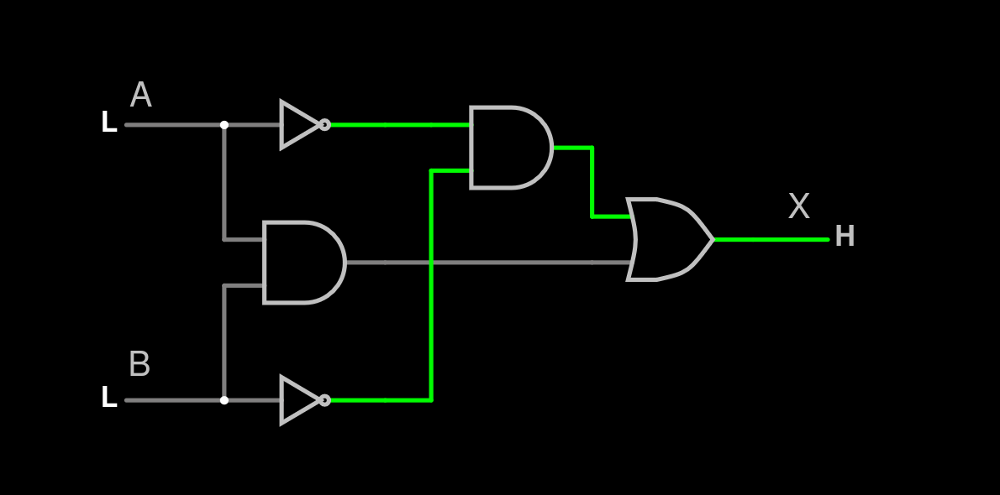
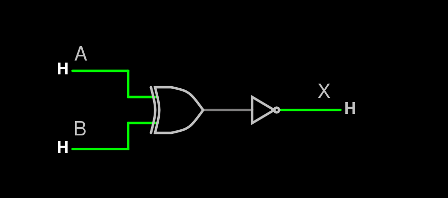

# Organización de Computadoras — Parcial de práctica
*Puntaje mínimo para aprobar: 5 pts*

---

## Ejercicio 1 — Circuitos y Compuertas [2.5 pts]

Dado el siguiente circuito con entradas **A, B** y salida **X**:

- Compuerta 1: AND entre A y B $\rightarrow$ salida $S_1$
- Compuerta 2: NOT de A $\rightarrow$ salida $S_2$
- Compuerta 3: NOT de B $\rightarrow$ salida $S_3$
- Compuerta 4: AND entre $S_2$ y $S_3$ $\rightarrow$ salida $S_4$
- Compuerta 5: OR entre $S_1$ y $S_4$ $\rightarrow$ salida $X$

Determiná la fórmula lógica que implementa, simplificala si es posible,
y completá la tabla de verdad para todas las entradas posibles.

---

## Ejercicio 2 — Representación de Números Enteros [2.5 pts]

Represente el valor $-19$ en binario con complemento a la base usando
la mínima cantidad de bits necesaria. Indique cuál es esa cantidad y el
rango de representación correspondiente, expresado como:

$$\left[-\frac{2^n}{2}, \frac{2^n}{2} - 1\right]$$

Luego multiplique ese valor por $3$ aplicando el algoritmo de
multiplicación que utiliza la ALU, explicando brevemente cada paso.

Describa qué es el **overflow** y cómo se detecta.

---

## Ejercicio 3 — Representación de Números Racionales [2.5 pts]

Con una representación de **1 bit de signo, 4 bits de exponente y 6 bits
de mantisa**, represente el número $-11.25$ (recuerde el bit oculto,
puede escribirlo como `S EEEE MMMMMM`).

Luego, dado el siguiente número en punto flotante con la convención **1 bit signo, 5 bits exponente y 6 bits mantisa**, determiná qué valor decimal representa:

$$0 \quad 10010 \quad 011010$$

Responda además:
- ¿Qué es el **bit oculto**?
- ¿Qué ventaja ofrece?
- ¿Cuál es su requisito?

---

## Ejercicio 4 — Arquitecturas Microprogramadas [2.5 pts]

Describa qué es el **FETCH** en el contexto de las arquitecturas
Von Neumann y liste las microinstrucciones que lo componen, para una
arquitectura de **16 bits** con **4 bits de OPCODE** y **10 bits de
direccionamiento**.

- ¿Cuántas posiciones de memoria puede direccionar esta arquitectura?
- ¿De cuántos bits son el PC, MAR, MDR e IR?
- ¿En cuánto se incrementa el PC y por qué?  

---  
 
 

# Resolución de ejercicios
## Ejercicio 1
La fórmula lógica que implementa es:
$$(\neg A \land \neg B)\lor(A \land B)$$
Es lo mismo que decir:
$$X = \overline{A} \cdot \overline{B} + A \cdot B$$

### Simplificando el circuito
$$
\begin{align*}
& (\neg A \land \neg B)\lor(A \land B) \\

& (\neg A \lor(A \land B)) \land (\neg B \lor(A \land B)) 
  & \text{(Distributiva $\lor\land)$} \\ 

& ((\neg A \lor A) \land (\neg A \lor B)) \land ((\neg B \lor A) \land (\neg B \lor B)) 
  & \text{(Distributiva $\lor\land$)} \\ 

& (\top \land (\neg A \lor B)) \land ((\neg B \lor A) \land \top) 
  & \text{(Tercero excluido)} \\ 

& (\neg A \lor B) \land (\neg B \lor A) 
  & \text{(Neutro)}
\end{align*}
$$

$$(\neg A \land \neg B)\lor(A \land B) \equiv A \Leftrightarrow B$$

 

Es decir que una fórmula equivalente sería $X = \overline{A \oplus B}$

 
 

#### Tabla de verdad de $(\neg A \land \neg B)\lor(A \land B)$

| $A$ | $B$ | $\neg A$ | $\neg B$ | $A \land B$ | $\neg A \land \neg B$ | $(\neg A \land \neg B)\lor(A \land B)$ | 
|--|--|--|--|--|--|--|
|T|T|F|F|T|F|T|
|T|F|F|T|F|F|F|
|F|T|T|F|F|F|F|
|F|F|T|T|F|T|T|

 

#### Tabla de verdad de $A \iff B$

| $A$ | $B$ | $A \iff B$ |
|---|--|--| 
| T | T |  T |
| T | F |  F |
| F | T |  F |
| F | F |  T |

 

### Circuito simplificado

 

## Ejercicio 2
Representar $-19$ en complemento a dos utilizando la mínima cantidad de bits.

|$32$|$16$|$8$|$4$|$2$|$1$|
|--|--|--|--|--|--|
|0|1|0|0|1|1|

$$19 = 010011_{(2)}$$
$-19$ en complemento a dos es:
$$-19 = 101101_{(2)}$$
Se útilizan mínimo $6$ bits.
 
 

#### Rango de representación con 6 bits en complemento a dos.
$$
\begin{align*}
    & \left[-\frac{2^6}{2}, \frac{2^6}{2} - 1 \right] \\ 
    &= \left[-\frac{64}{2}, \frac{64}{2} - 1 \right] \\
    &= \left[-32, 32 - 1 \right] \\
    &= \left[-32, 31 \right] \\
\end{align*}
$$

El rango de representación con 6 bits es $[-32, 31]$

 

### Multiplicación como ALU
#### $-19 \cdot 3 = -57$

 

$-19 = 101101_{(2)}$

$3 = 000011_{(2)}$

$57 = 0111001_{(2)}$

$-57 = 1000111_{(2)}$

<table>
  <thead>
    <tr>
      <th>101101</th>
      <th></th>
    </tr>
    <tr>
      <th>000000</th>
      <th>000011</th>
    </tr>
  </thead>
  <tbody>
    <tr>
      <td>101101</td>
      <td>000011</td>
      <td>+</td>
    </tr>
    <tr>
      <td>110110</td>
      <td>100001</td>
      <td>>></td>
    </tr>
    <tr>
      <td>100011</td>
      <td>100001</td>
      <td>+</td>
    </tr>
    <tr>
      <td>110001</td>
      <td>110000</td>
      <td>>></td>
    </tr>
    <tr>
      <td>111000</td>
      <td>111000</td>
      <td>>></td>
    </tr>
    <tr>
      <td>111100</td>
      <td>011100</td>
      <td>>></td>
    </tr>
    <tr>
      <td>111110</td>
      <td>001110</td>
      <td>>></td>
    </tr>
    <tr>
      <td>111111</td>
      <td>000111</td>
      <td>>></td>
    </tr>
  </tbody>
</table>

Resultado = $111111000111_{(2)} = -57$

 

El overflow sucede cuando al hacer alguna operación aritmetica entre dos números en complemento a la base, el resultado cae fuera del rango de represantación. Un ejemplo sería que estemos sumando dos números negativos y el resultado da un número positivo. 
 
 El *overflow* se puede detectar mirando los últimos dos acarreos en la operación: si estos difieren, hay overflow.

 

## Ejercicio 3
1 bit signo, 4 bits exponente, 6 bits mantisa. Representar $-11,25$

|$8$|$4$|$2$|$1$|$0,5$|$0,25$|
|--|--|--|--|--|--|
|1|0|1|1|0|1|

$-11,25 = 1011,01_{(2)}$

Normalizado

$-11,25 = 1,01101 \cdot 2^3$

 

$$bias = \frac{2^4}{2}-1 = \frac{2 \cdot 2^4}{2}-1 = 2^3 - 1 = 8 - 1 = 7$$
$$exp. real = 7 + 3 = 10 = 1010_{(2)} $$

| S | E | M |
|---|---|---|
|1|1010|01101|

$$1 \quad 1010 \quad 01101$$
$-11,25$ en punto flotante es: $1 1010 01101_{(2)}$

 

#### Punto flotante a decimal.
$$0 \quad 10010 \quad 011010$$

$exp = 10010_{(2)} = 18$

$$bias = \frac{2^5}{2} - 1 = \frac{2 \cdot 2^4}{2} - 1 = 2^4 - 1 = 16 - 1 = 15$$

$$exp.real = 18 - 15 = 3$$

$1,01101 \cdot 2^3 = 1011,01_{(2)}$

|$8$|$4$|$2$|$1$|$0,5$|$0,25$|
|--|--|--|--|--|--|
|1|0|1|1|0|1|

$$0 \quad 10010 \quad 011010 = 11,25$$

 

#### Respuestas
- El bit oculto es una técnica usada en la representación de números con punto flotante. Consiste en no escribir el bit significativo en el número, sino que se deja *oculto*. Es decir, como al normalizar los números, todos empiezan en 1, obviamos ese bit significativo; pero siempre se tiene en cuenta a la hora de pasar de punto flotante a decimal.
- La ventaja que ofrece es que deja un bit más de la matisa para poder utilizar. De esa forma, se gana un poco más de precisión.
- El requisito que tiene el bit oculto es que se deben normalizar todo número que vaya a ser representado en punto flotante.

 

## Ejercicio 4
El FETCH en las arquitecturas Von Neumann es una intrucción del procesador común a todas las demás intrucciones. Su función es traer datos de la memoria y decodificarlos, para luego poder ejecutar la instrucción que ese registro representa.

 

En una arquitectura de 16 bits, con 4 bits de OPCODE y 10 bits de direccionamiento, la implementación es la siguiente.

El FETCH consiste de 5 instrucciones, iguales en todas las arquitecturas:
1. PC $\rightarrow$ MAR: Colocar en el Memory Address Register la dirección del Program Counter.
2. Mem[MAR] $\rightarrow$ MDR: Extraer de la memoria los datos de la dirección MAR y ponerlos en el Memory Data Register.
3. MDR $\rightarrow$ IR: Llevar el registro del MDR al Instruction Registero.
4. INC-PC: Incrementar el Program Counter.
5. DECODE-IR: Decodificar la instrucción en Instruction Register.

Las únicas especificaciones en esta implmentación completa son:
- En el paso 2, al ser una arquitectura de 16 bits, y las celdas de memoria tienen 8 bits cada una; se observan dos celdas a la vez para obtener el dato y dejarlo en MDR. Es decir, la primera celda se pone en la primera mitad del MDR: MDR[0..7], y la segunda celda en la segunda mitad del MDR: MDR[8..15].
- En el 4 paso, el Program Counter se incrementa en $2$, así respetamos que las próximas dos celdas sean las siguientes.
- Para el obtener el OPCODE revisamos IR[0..3] en la convención usada en nuestra clase el OPCODE va a la izquierda, teniendo endianidad BIG ENDIAN.

Entonces nuestro procesador quedaría de la siguiente manera:

| Registro | Nº bits |
|--|--|
| PC | 10|
| MAR | 10|
| MDR | 16|
| IR | 16|

$2^{10} = 1024$ direcciones.

$1024b / 1024 = 1KB$

Esta arquitectura puede alojar 1024 direcciones de memoria, es decir, el tamaño máximo de memoria es 1KB.
